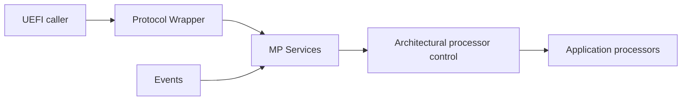
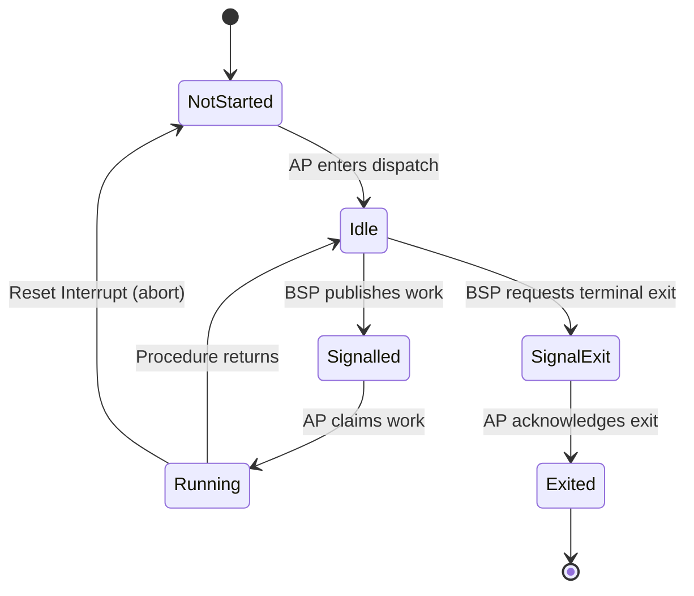

# Multiprocessor Services

Patina implements the UEFI MP Services Protocol by separating UEFI policy from
architecture-specific processor control. DXE Core owns memory, protocol behavior,
and request scheduling. The CPU layer owns AP startup, architectural state, and
processor control.

## DXE Core

### Component

The component consumes the platform's processor handoff, allocates persistent AP
contexts and guarded stacks, initializes architecture support, installs the MP
Services Protocol, and manages notifications and protocol-level state. Architecture
initialization and AP setup are separate phases: `initialize` allocates resources
that are private to the architecture, while `setup_aps` binds the caller-provided
contexts to processors and starts the APs.

The component also registers lifecycle events:

- Cache-attribute changes synchronize the BSP's MTRRs to every healthy AP.
- ReadyToBoot rejects new asynchronous dispatches and waits for pending requests
  to complete or reach their original deadlines.
- ExitBootServices parks all APs.

If no usable handoff is available, the protocol is still installed and reports a
uniprocessor system containing only the BSP.

### Service

The service owns UEFI processor numbering, processor selection, health state,
timeouts, and synchronization policy. Scheduling is serialized so an AP cannot
be assigned to overlapping requests or architectural synchronization work.

Blocking and non-blocking operations follow the same scheduling and timeout rules.
Non-blocking requests are progressed by a periodic event and notify the caller only
after completion or timeout. A single deadline bounds the complete operation rather
than granting a fresh timeout to each processor.

On x64, an AP that misses a deadline is restarted with INIT-SIPI-SIPI and returned
to its dispatch environment. If that recovery does not complete within its bounded
health window, the AP is marked unhealthy and disabled for future dispatch. A zero
timeout has no deadline and may wait indefinitely.

### Protocol

The protocol layer is intentionally a thin UEFI adapter. It validates ABI inputs,
delegates policy to the service, and translates results back into UEFI status and
output formats. No scheduling or processor-control policy belongs at this boundary.

Switching the BSP is not supported at this time.

## Architectural Processor Control

The CPU layer (`patina_internal_cpu`) provides a common multiprocessor control
boundary while keeping architecture-specific startup and shutdown mechanisms
private. It manages AP identity, execution state, work delivery, and architectural
synchronization.

This layer is intended to abstract just the fine-grain management of the processors
and processor management.

### Processor State Machine

Each AP follows a small execution state machine shared by all supported
architectures. The BSP is the only producer of work, and the AP is the only
consumer. This ownership model prevents two requests from running on the same AP
at once.

Every dispatch receives a new identity when work moves from `Idle` to
`Signalled`. Completion is checked against that identity, preventing a later
dispatch from being mistaken for an earlier one.

A timed-out dispatch resets the AP state to `NotStarted` and restarts the AP using
the architecture-specific recovery mechanism. The abandoned procedure cannot
publish ordinary completion. The restarted processor re-enters the state machine
through the normal `NotStarted` to `Idle` transition. The BSP waits for this
acknowledgement for an architecture-specific recovery period. If the AP does not
reach `Idle` in time, it is marked unhealthy and disabled.

`SignalExit` is the terminal shutdown path. It cancels work that has not yet been
claimed, while a running procedure observes the request after it returns. The AP
then acknowledges the request by moving to `Exited`; it cannot accept further
dispatches.

Processor enablement and health are tracked separately from execution state.
Disabling an AP prevents future work but does not interrupt a procedure already
running. A disabled AP becomes eligible again only after its current work has
finished and platform policy explicitly re-enables it.

## X64

On x64, initial AP startup uses the processors inherited from PEI. PEI leaves them
in a known wait loop and provides the information DXE needs to redirect them into
the Patina dispatch environment. Each AP then adopts the required BSP state,
applies the BSP's MTRR configuration, and waits for work from DXE Core. Later
recovery uses INIT-SIPI-SIPI and the same long-mode setup path.

Architecture initialization allocates and prepares resources that do not belong
in the common MP interface:

- One executable bootstrap page below 1 MiB for the SIPI vector.
- A seven-page reserved-memory terminal parking environment.

DXE Core separately allocates one persistent context and guarded stack for each AP.
The x64 setup phase installs each AP's GDT and TSS, publishes the shared exception
IDT and BSP control-register state, captures the BSP MTRRs, and wakes the APs from
their PEI wait loops. An AP is counted as started only after it has applied the MTRR
state and entered the dispatch state machine.

### Handoff requirements

MP startup uses the EDK II `MP_HAND_OFF`, `MP_HAND_OFF_CONFIG`, and optionally
`MP_INFORMATION2` HOBs. The handoff must provide:

- A compatible 64-bit AP wait-loop environment.
- A unique and valid identity for every processor, including the BSP.
- Valid wake-up information for each AP.
- Consistent processor information across the supplied records.

EDK2 controls the PEI AP wait loop with `gUefiCpuPkgTokenSpaceGuid.PcdCpuApLoopMode`.
Patina requires a loop that can be woken by a memory write, so suitable settings are:

- `2`, the MWAIT loop, when MONITOR/MWAIT is available.
- `3`, the Run loop.

The default value, `1`, selects the HLT loop and does not provide a usable
store-based handoff. The PEI handoff must also report an execution mode matching
x64 DXE (`WaitLoopExecutionMode` equal to `8`).

Malformed or incompatible handoff data falls back to BSP-only operation. PEI BIST
health is retained and reported through `GetProcessorInfo`.

### INIT-SIPI-SIPI Recovery

x64 timeout recovery performs the architectural INIT-SIPI-SIPI sequence. Before
sending INIT, the BSP records whether the AP had started and waits for the INIT
settling interval. It then decrements startup accounting when necessary, resets
the AP state machine to `NotStarted`, resets the AP's busy TSS descriptor, and
sends two SIPIs separated by the required delay. Targeted INIT and SIPI delivery
support both xAPIC and x2APIC modes.

The SIPI vector points to a position-independent bootstrap in one page below
1 MiB. The bootstrap begins in real mode, installs a temporary GDT, enters
protected mode and then long mode, and transfers to the shared AP setup entry.
The transition requires the BSP root page table to be addressable by 32-bit CR3.

The shared setup entry restores the BSP's EFER, CR0, CR4, and CR3, identifies the
processor by APIC ID, selects its persistent context and stack, and installs its
GDT, TSS, and the shared AP exception IDT. Rust then reapplies the BSP MTRRs and
enters the normal dispatch loop. Reaching `Ready` acknowledges successful recovery;
otherwise the BSP marks the AP unhealthy and disables it after the bounded recovery
window.

### Architectural Synchronization

The BSP captures its MTRR configuration before initial AP startup. Every AP applies
that configuration before it is counted as started. Cache-attribute-change events
recapture the BSP state and dispatch one mandatory synchronization operation to
every enabled AP. This operation has no timeout: success means all targeted APs
have completed, and setup or application failures are reported through the AP
failure mechanism.

Before invoking each dispatched procedure, an x64 AP reloads CR3 to invalidate its
non-global cached translations. The reload occurs after the AP acquires the
published work, so page-table updates sequenced before dispatch are visible before
the procedure begins.

### AP Failure Reporting

AP setup and dispatch failures are not converted into ordinary request timeouts.
The AP publishes the first failure in a shared atomic record containing a reason,
APIC ID, and 64-bit detail value, then halts. The recording sentinel prevents the
BSP from observing partially written diagnostics. BSP polling paths acquire the
published record and panic with the captured context.

The setup exception IDT has dedicated handlers for divide error, breakpoint,
invalid opcode, double fault, general-protection fault, and page fault. Other
vectors use a generic exception reason. Page faults report the full `CR2` value;
general-protection and double faults report their hardware error code. Additional
reported failures include a missing AP context, rejection by the dispatch state
machine, failure to apply MTRRs, and an unexpected return from the non-returning
AP entry point.

Only the first failure is retained. Once an AP publishes a failure, it disables
interrupts and halts permanently. Exceptions after an AP has entered the terminal
reserved-memory park environment are intentionally ignored and converge directly
on its halt loop.

### Exit Boot Services State

Before `ExitBootServices`, Patina stops accepting new AP work and requests the
terminal `SignalExit` transition on every AP. An idle AP leaves its dispatch loop
immediately. An AP already running a procedure leaves after that procedure returns.
Each AP then transfers into a position-independent long-mode parking environment
allocated from reserved memory.

The parking environment occupies seven pages aligned to 16 KiB:

- Code page containing the halt loop.
- Data page containing the park configuration,  acknowledgement counter,
  minimal GDT, and shared stack top.
- IDT page whose entries converge on a terminal exception halt handler.
- Four pages containing the private four-level page tables.

When the Rust dispatch loop observes `SignalExit`, it calls the non-returning park
entry directly. The entry disables interrupts and transfers to the reserved park
stub, which loads the parking GDT, IDT, stack, and CR3, then increments the
parked-processor counter. Returning from the Rust AP entry point instead is treated
as an AP setup failure.

The private page tables map only the parking code, data, and IDT pages, so the AP
no longer depends on DXE mappings, stacks, or executable firmware images. It clears
nonessential register state and remains in a `HLT` loop. Any exception entering
the parking IDT also converges on a terminal halt loop without using the shared
stack.

The BSP waits for all APs to increment the parked counter, subject to a bounded
timeout. This implementation opts to always wait for all started APs to have to
reach the park page.
