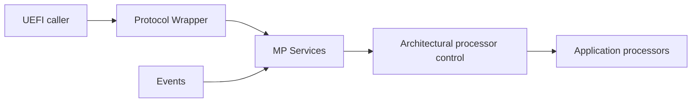
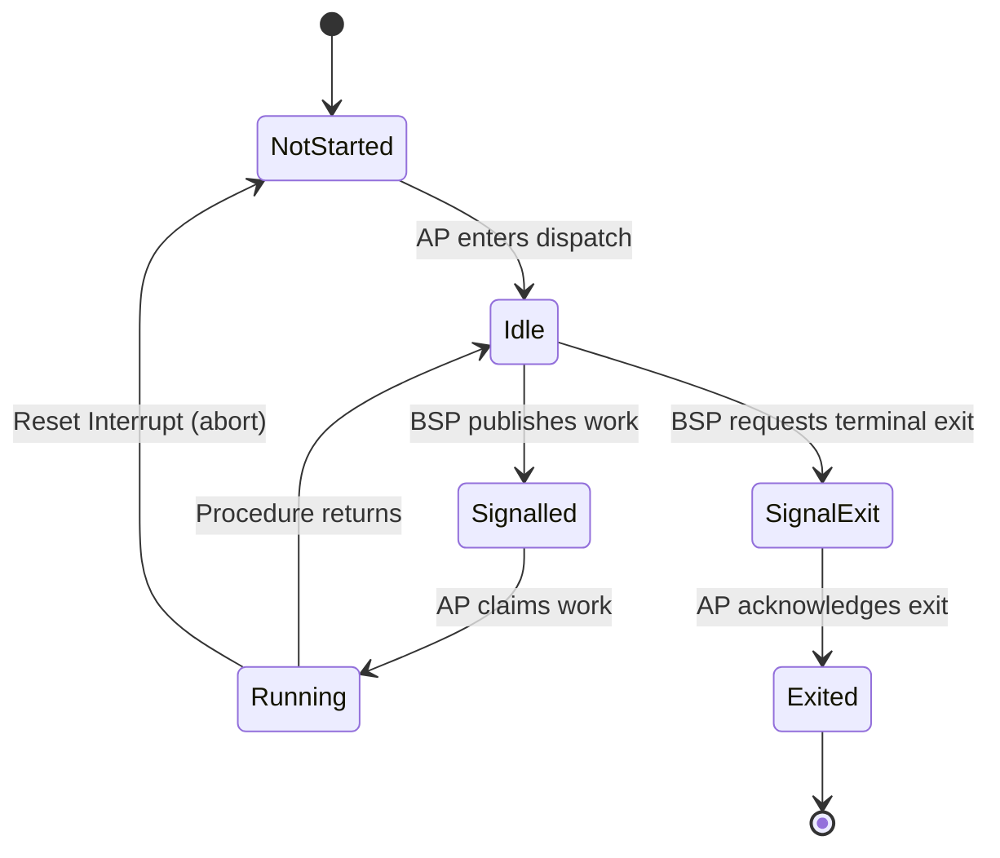

# Multiprocessor Services

Patina implements the UEFI MP Services Protocol by separating UEFI policy from
architecture-specific processor control. DXE Core owns memory, protocol behavior,
and request scheduling. The CPU layer owns AP startup, architectural state, and
processor control.

## DXE Core

### Component

The component consumes the platform's processor handoff, allocates persistent AP
resources, initializes architecture support, installs the MP Services
Protocol, and manages notifications and protocol-level state.

The component also registers lifecycle events:

- Cache-attribute changes synchronize the BSP's MTRRs to every healthy AP.
- ReadyToBoot rejects new asynchronous dispatches and waits for pending requests
  to complete or reach their original deadlines.
- ExitBootServices parks all APs.

If no usable handoff is available, the protocol is still installed and reports a
uniprocessor system containing only the BSP.

### Service

The service owns UEFI processor numbering, processor selection, health state,
timeouts, and synchronization policy. Scheduling is serialized so an AP cannot
be assigned to overlapping requests or architectural synchronization work.

Blocking and non-blocking operations follow the same scheduling and timeout rules.
Non-blocking requests are progressed by a periodic event and notify the caller only
after completion or timeout. A single deadline bounds the complete operation rather
than granting a fresh timeout to each processor.

On x64, an AP that misses a deadline is interrupted and returned to its dispatch
environment. If that recovery does not complete within its bounded health window,
the AP is marked unhealthy and disabled for future dispatch. A zero timeout has
no deadline and may wait indefinitely.

### Protocol

The protocol layer is intentionally a thin UEFI adapter. It validates ABI inputs,
delegates policy to the service, and translates results back into UEFI status and
output formats. No scheduling or processor-control policy belongs at this boundary.

Switching the BSP is not supported at this time.

## Architectural Processor Control

The CPU layer (`patina_internal_cpu`) provides a common multiprocessor control
boundary while keeping architecture-specific startup and shutdown mechanisms
private. It manages AP identity, execution state, work delivery, and architectural
synchronization.

This layer is intended to abstract just the fine-grain management of the processors
and processor management.

### Processor State Machine

Each AP follows a small execution state machine shared by all supported
architectures. The BSP is the only producer of work, and the AP is the only
consumer. This ownership model prevents two requests from running on the same AP
at once.

Every dispatch receives a new identity when work moves from `Idle` to
`Signalled`. Completion is checked against that identity, preventing a later
dispatch from being mistaken for an earlier one.

A timed-out dispatch resets the AP state to `NotStarted` and interrupts/resets the
AP. The interrupt abandons the current procedure, restores the dispatch
environment, and re-enters the state machine through the normal
`NotStarted` to `Idle` transition. The BSP waits for this acknowledgement for an
architecture-specific recovery period. If the AP does not reach `Idle` in time,
it is marked unhealthy and disabled.

`SignalExit` is the terminal shutdown path. It cancels work that has not yet been
claimed, while a running procedure observes the request after it returns. The AP
then acknowledges the request by moving to `Exited`; it cannot accept further
dispatches.

Processor enablement and health are tracked separately from execution state.
Disabling an AP prevents future work but does not interrupt a procedure already
running. A disabled AP becomes eligible again only after its current work has
finished and platform policy explicitly re-enables it.

## X64

On x64, APs are inherited from PEI rather than restarted by DXE. PEI leaves them
in a known wait loop and provides the information DXE needs to redirect them into
the Patina dispatch environment. Each AP then adopts the required BSP state and
waits for work from DXE Core.

### Handoff requirements

MP startup uses the EDK II `MP_HAND_OFF`, `MP_HAND_OFF_CONFIG`, and optionally
`MP_INFORMATION2` HOBs. The handoff must provide:

- A compatible 64-bit AP wait-loop environment.
- A unique and valid identity for every processor, including the BSP.
- Valid wake-up information for each AP.
- Consistent processor information across the supplied records.

EDK2 controls the PEI AP wait loop with`gUefiCpuPkgTokenSpaceGuid.PcdCpuApLoopMode`.
Patina requires a loop that can be woken by a memory write, so suitable settings are:

- `2`, the MWAIT loop, when MONITOR/MWAIT is available.
- `3`, the Run loop.

The default value, `1`, selects the HLT loop and does not provide a usable
store-based handoff. The PEI handoff must also report an execution mode matching
x64 DXE (`WaitLoopExecutionMode` equal to `8`).

Malformed or incompatible handoff data falls back to BSP-only operation. PEI BIST
health is retained and reported through `GetProcessorInfo`.

### NMI Reset Mechanism

x64 timeout recovery uses a targeted non-maskable interrupt rather than an
INIT-SIPI restart. Before sending the NMI, the BSP resets the AP execution state
to `NotStarted`. This prevents the interrupted dispatch from publishing ordinary
completion and reserves the next `NotStarted`-to-`Idle` transition as the recovery
acknowledgement.

Vector 2 is dedicated to AP reset in the Patina AP interrupt table. Its handler
replaces the saved instruction pointer in the NMI frame with the recovery entry,
clears the saved trap and interrupt-enable flags, and executes the 64-bit
interrupt-return instruction. Taking the interrupt-return path clears architectural
NMI blocking before recovery continues. The original procedure, stack frame, and
register state are abandoned.

The recovery entry reinstalls the BSP-provided descriptor tables, extended feature
register, control registers, and page tables. It then identifies the AP by its
APIC ID, switches to that AP's persistent stack, reloads the segment registers,
and enters the normal dispatch loop. Recovery does not increment initial AP
startup accounting. The dispatch loop moves the state from `NotStarted` to
`Idle`, acknowledging that the AP can accept work again.

The BSP supports targeted NMI delivery through both xAPIC and x2APIC. In xAPIC
mode, it waits for the interrupt-command register to become idle before publishing
the destination and NMI command. This mechanism assumes that vector 2 is reserved
for AP reset; any NMI delivered to an AP in this environment initiates recovery.

### Exit Boot Services State

Before `ExitBootServices`, Patina stops accepting new AP work and requests the
terminal `SignalExit` transition on every AP. An idle AP leaves its dispatch loop
immediately. An AP already running a procedure leaves after that procedure returns.
Each AP then transfers into a position-independent long-mode parking environment
allocated from reserved memory.

The parking environment occupies seven pages aligned to 16 KiB:

- Code page containing the halt loop.
- Data page containing the park configuration,  acknowledgement counter,
  minimal GDT, and shared stack top.
- IDT page whose entries converge on a terminal exception halt handler.
- Four pages containing the private four-level page tables.

On entry, an AP disables interrupts, loads the parking GDT, IDT, stack, and CR3,
then increments the parked-processor counter. The private page tables map only the
parking code, data, and IDT pages, so the AP no longer depends on DXE mappings,
stacks, or executable firmware images. It clears nonessential register state and
remains in a `HLT` loop. Any exception entering the parking IDT also converges on
a terminal halt loop without using the shared stack.

The BSP waits for all APs to increment the parked counter, subject to a bounded
timeout. This implementation opts to always wait for all started APs to have to
reach the park page.
